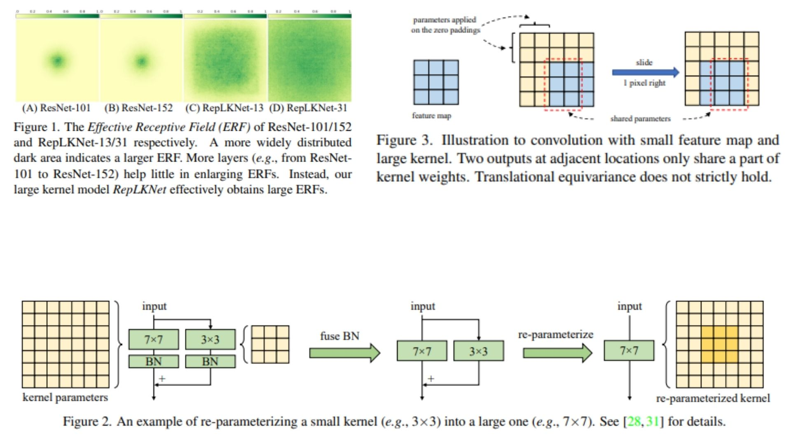

# 🌁 LargeKernel-Replication — Revisiting Large Kernel Design in CNNs

This repository presents a **faithful PyTorch replication** of the large-kernel
convolutional design proposed in *Scaling Up Your Kernels to 31×31: Revisiting Large Kernel Design in CNNs* 

The goal is **theoretical and architectural fidelity**: translating the paper’s
**kernel decomposition, re-parameterization rules, and block-level structure**
into clean, modular code — **without training, datasets, or empirical evaluation** 

The focus is strictly on how **very large effective receptive fields** can be
implemented efficiently using **structural re-parameterization**, rather than
dynamic mechanisms such as attention or gating 🧩.

Paper reference:  [Scaling Up Your Kernels to 31×31: Revisiting Large Kernel Design in CNNs (CVPR 2022)](https://arxiv.org/abs/2203.06717)


---

## Overview — Large Kernels Without Large Inference Cost 🔍



>Standard CNNs typically rely on stacking small kernels (e.g. 3×3) to grow the
>receptive field gradually. While effective, this approach limits **direct
>long-range spatial interaction** and often increases network depth unnecessarily.

The large-kernel design revisits this assumption by explicitly using
**very large depthwise convolution kernels** (up to 31×31), enabling:

- Direct aggregation of long-range spatial context 🌐
- Shallower yet expressive architectures 🧱
- Strong inductive bias for global feature modeling 🧭

Naively deploying such kernels is computationally expensive.  
The shown design resolves this by introducing **structural re-parameterization**:
a multi-branch formulation during construction that collapses into a
**single equivalent large kernel** at inference time .

---

## Large Kernel Re-Parameterization 🧮

Given an input feature map

$$
X \in \mathbb{R}^{C \times H \times W},
$$

the large-kernel block is expressed as a sum of multiple depthwise convolutions
with different kernel sizes:

$$
Y = X + \sum_{i=1}^{N} X * K_i,
$$

where each

$$
K_i \in \mathbb{R}^{k_i \times k_i}, \quad k_i < k_{\text{max}}.
$$

Each branch captures spatial context at a distinct scale, while all convolutions
remain **depthwise**, preserving computational efficiency 🪶.

---

### Kernel Fusion Rule 🔗

During re-parameterization, all branch kernels are embedded into a single
large kernel of size $k_{\text{max}}$ via zero-padding and summation:

$$
K_{\text{fused}} = \sum_{i=1}^{N} \text{Pad}(K_i, k_{\text{max}}).
$$

This yields a **single depthwise convolution** such that

$$
X * K_{\text{fused}} \equiv X + \sum_{i=1}^{N} X * K_i.
$$

Thus, the **training-time multi-branch structure** and the
**deployment-time single-kernel structure** are mathematically equivalent ✨.

---

## Architectural Interpretation 🏗️

- Large receptive fields are encoded **structurally**, not dynamically
- No attention, no scale competition, no input-conditioned routing
- Multi-branch design exists only to enable kernel fusion
- Inference uses depthwise convolutions with a large kernel
- Fully compatible with residual connections and pointwise convolutions

The resulting blocks are typically wrapped inside residual structures,
ensuring stable optimization while preserving expressive spatial modeling 🔁.

---

## Repository Structure 🗂️

```bash
LargeKernel-Replication/
├── src/
│   ├── utils/
│   │   └── visualization.py
│   │
│   ├── kernels/
│   │   └── reparam_rules.py
│   │
│   ├── layers/
│   │   ├── dwconv.py
│   │   ├── lkc_multi_branch.py
│   │   └── lkc_reparam.py
│   │
│   ├── blocks/
│   │   ├── lkc_block.py
│   │   └── residual_lkc.py
│   │
│   ├── models/
│   │   ├── backbone_stub.py
│   │   └── lkcnet_stub.py
│   │
│   ├── pipeline.py
│   └── config.py
│
├── images/
│   └── figmix.jpg
│
├── requirements.txt
└── README.md
```
---


## 🔗 Feedback

For questions or feedback, contact: [barkin.adiguzel@gmail.com](mailto:barkin.adiguzel@gmail.com)
